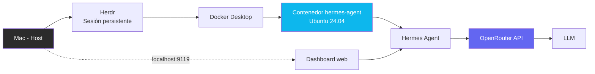

# Hermes Infra — Hermes Agent en Docker con dashboard web

Infraestructura containerizada para correr [Hermes Agent](https://github.com/NousResearch/hermes-agent) (Nous Research) de forma reproducible, con interfaz web y sin depender de una instalación nativa en el sistema operativo.

## Motivación

Instalar Hermes Agent directamente en macOS con procesador Intel presenta conflictos de compilación (dependencias Rust/OpenSSL) y las herramientas habituales para resolverlos (Homebrew, OrbStack) ya no soportan ese hardware. La solución fue encapsular todo el entorno en un contenedor Docker basado en Ubuntu 24.04, garantizando un entorno consistente independiente del equipo host.

## Stack

- **Docker + Docker Compose**: containerización y orquestación del servicio
- **Ubuntu 24.04**: sistema base del contenedor
- **Hermes Agent**: framework de agente de IA autónomo, open source
- **OpenRouter**: agregador de proveedores de modelos LLM (incluye modelos gratuitos)
- **socat**: reenvío de puerto para exponer el dashboard sin comprometer su modelo de seguridad
- **Herdr**: sesiones de terminal persistentes (opcional)

## Arquitectura



## Requisitos

- Docker Desktop instalado y abierto
- Una API key de [OpenRouter](https://openrouter.ai) (hay modelos gratuitos disponibles)

## Inicio rápido

```bash
git clone https://github.com/itica-spa/hermes-infra.git
cd hermes-infra
cp .env.example .env
nano .env    # agrega tu OPENROUTER_API_KEY
docker compose up -d --build
docker exec -it hermes-agent bash
hermes model    # elegir OpenRouter y un modelo
```

Luego abre el dashboard en `http://localhost:9119`.

## Operación

| Acción | Comando |
|---|---|
| Iniciar | `docker compose up -d` |
| Parar (conserva datos) | `docker compose stop` |
| Reiniciar | `docker compose restart` |
| Logs | `docker logs hermes-agent` |
| Chat por terminal | `docker exec -it hermes-agent bash` y luego `hermes` |

La configuración, perfiles e historial persisten en el volumen `hermes-data`. Evita `docker compose down -v`, que lo elimina.

## Decisiones técnicas

- **Dashboard sobre loopback + `socat`:** Hermes se niega a escuchar en una dirección pública sin autenticación. En lugar de debilitarlo, el dashboard escucha en `127.0.0.1` dentro del contenedor y `socat` reenvía el tráfico hacia el puerto publicado.
- **Puerto publicado solo en `127.0.0.1`:** únicamente el equipo host puede acceder a la interfaz.
- **`init: true`:** evita procesos zombi generados por `socat`.
- **Secretos fuera del repositorio:** `.env` está en `.gitignore`; solo se versiona `.env.example`.

## Documentación

El manual completo de instalación, operación y resolución de errores está en [`docs/MANUAL.md`](docs/MANUAL.md).

## Próximos pasos

- [x] Contenedor con Hermes Agent y OpenRouter
- [x] Dashboard web accesible desde el navegador
- [x] Manual de instalación y solución de errores
- [ ] Perfil `documentador` con GitHub CLI
- [ ] Integrar Anthropic Claude como proveedor adicional
- [ ] Despliegue en VPS para disponibilidad 24/7

## Autor

[itica-spa](https://github.com/itica-spa)
