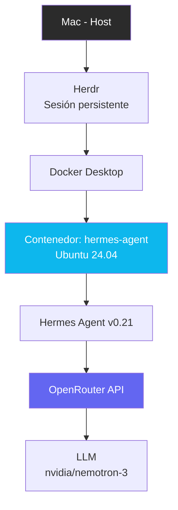

# Hermes Infra — Agente de IA local con Docker

Infraestructura containerizada para correr [Hermes Agent](https://github.com/NousResearch/hermes-agent) (Nous Research) de forma reproducible, sin depender de instalación nativa en el sistema operativo host.

## Motivación

Este proyecto resuelve un problema real de compatibilidad: instalar Hermes Agent nativamente en macOS con procesador Intel presenta conflictos de compilación (dependencias Rust/OpenSSL). La solución fue encapsular todo el entorno en un contenedor Docker basado en Ubuntu 24.04, garantizando un entorno de ejecución consistente independiente del hardware host.

## Stack

- **Docker + Docker Compose** — containerización y orquestación del servicio
- **Ubuntu 24.04** — sistema base del contenedor
- **Hermes Agent v0.21** — framework de agente de IA autónomo, open source
- **OpenRouter** — proveedor de modelos LLM (agregador multi-proveedor)
- **Herdr** — gestor de sesiones de terminal persistentes (mantiene el agente corriendo entre desconexiones)

## Arquitectura

## Requisitos

- Docker Desktop instalado
- Una API key de [OpenRouter](https://openrouter.ai) (tiene modelos gratuitos disponibles)

## Instalación

\`\`\`bash
git clone https://github.com/itica-spa/hermes-infra.git
cd hermes-infra
cp .env.example .env
# Edita .env y agrega tu OPENROUTER_API_KEY
docker compose up -d --build
docker exec -it hermes-agent bash
hermes model  # configurar proveedor y modelo
\`\`\`

## Uso

\`\`\`bash
docker exec -it hermes-agent bash
hermes
\`\`\`

## Notas técnicas

- El error de compilación \`cryptography\`/Rust en macOS Intel se evita completamente al ejecutar dentro de un contenedor Linux, donde existen wheels precompilados.
- La configuración persiste entre reinicios del contenedor gracias al volumen \`hermes-data\`.

## Próximos pasos

- [ ] Configurar Bot Mode con agentes especializados por rol
- [ ] Integrar Anthropic Claude como proveedor adicional
- [ ] Documentar despliegue en VPS para disponibilidad 24/7

## Autor

[itica-spa](https://github.com/itica-spa)
